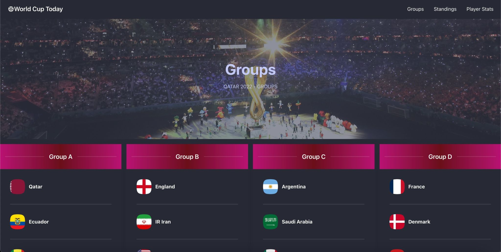

# World Cup Today 

React Front End Application that allows users to keep up with the latest scores, player stats, and group leaders for the 2022 Qatar World Cup. 

---

## License


---

## Table of Contents:

- [License](#license)
- [Technologies](#technologies)
- [Installation](#installation)
- [Application](#application)
- [Contact](#contact)

---

## Technologies:

- React
- Tailwind

---

## Installation


1. Clone repo from GitHub

   ```
   gh repo clone geoescobar/world-cup-today
   ```

2. Download dependencies at root level in the integrated terminal

   ```
   npm install
   ```

3. Launch application

   ```
   npm run start
   ```

---

## Application

#### [Demo](https://world-cup-today.onrender.com/)



